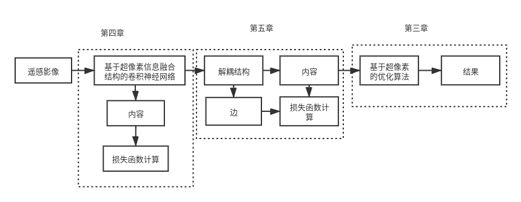

# RS_deepLearn
遥感分割论文中的代码
注意这里分为两组代码 ubuntu 与 windows两组，均从master分支拉取
2021 4.15 23:49
梳理存在的问题

## 第三章
### 需要解决的问题
- [ ] 基于RGB数据集原始模型的训练
- [ ] SLIC 超像素算法实现
- [ ] quick shift算法结构
- [ ] 利用超像素优化神经网络的输出
- [ ] 原始网络模型数据集的训练结果对比
- [ ] 原始超像素算法与新构建超像素算法之间的对比
### 章节内容安排
- [ ] 研究区域介绍（建议第二章）
- [ ] 影像预处理介绍（建议第二章）
- [ ] 理论介绍
  - [ ] 超像素算法介绍
  - [ ] 优化算法详解
- [ ] 数据集制作
  - [ ] 影像RGB数据集制作
  - [ ] 影像指数数据集
  - [ ] 影像全波段数据集
  - [ ] 数据集训练集与测试集划分
- [ ] 实验结果与分析
  - [ ] 训练参数
  - [ ] fcn、unet、segnet三个模型训练损失变化图
  - [ ] fcn、unet、segnet三个模型训练的精度变化图
  - [ ] fcn、unet、segnet基于超像素算法的对比图
  - [ ] 各个数据集的fcn、unet、segnet模型的汇总图
  - [ ] 结果精度表
  - [ ] 实验结果对比分析
- [ ] 本章小结 
## 第四章
### 需要解决的问题
- [ ] 边界损失函数的构建问题
- [ ] 超像素信息与神经网络的融合结构(初步定名 superpixel-encoding-Net)
- [ ] 超像素网络结果与原始模型训练结果对比
### 章节内容安排
- [ ] 引言
- [ ] 理论介绍
  - [ ] 超像素融合结构
  - [ ] 损失函数设计
- [ ] 实验结果与分析
  - [ ] 训练参数介绍
  - [ ] 各个数据集中的网络模型的训练损失图
  - [ ] 各个数据集中的网络模型的精度变化图
  - [ ] 各个数据集中训练得到的网络效果对比图
  - [ ] 实验结果对比分析
- [ ] 小结 

## 第五章
### 需要解决的问题
- [ ] 解耦结构的实现
- [ ] 解耦网络模型训练与之前模型训练结果对比
### 章节内容安排
- [ ] 引言
- [ ] 理论介绍
  - [ ] 解耦结构对比
  - [ ] 整体算法模型结构
  - [ ] 损失函数
- [ ] 实验结果与分析
  - [ ] 数据集训练的网络模型损失值变化图
  - [ ] 网络模型的精度图
  - [ ] 整体网络模型精度对比表
  - [ ] 网络模型的效果图
  - [ ] 实验结果对比分析
- [ ] 小结

## 需要训练的数据集与模型
|  数据集   | fcn  | unet| segnet | superPixel-encodingNet | SPE-decouple-Net|
|  ----  | ----  |  ----  |  ----  |  ----  |  ----  |
| RGB123  | ok | ok | model_err | designing | designing |
| RGB124  | ok | ok | model_err | designing | designing |
| RGB134  | ok | ok | model_err | designing | designing |
| RGB234  | ok | ok | model_er | designing | designing |
| 指数数据集  | trainErr | ok | model_er | designing | designing |
| allbands  | wait | wait | model_err | designing | designing |

## 文章基本结构图

在第四章中，为了获得更好的效果，特意使用了边界敏感损失项，但是并没有在结构图中的体现
